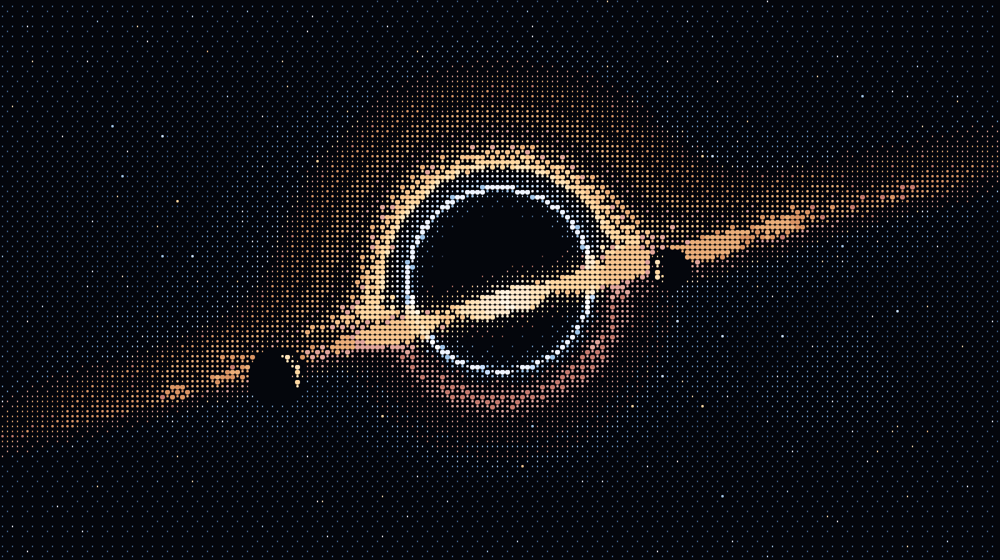

  

  <samp>local-first ai &nbsp;·&nbsp; coding agents &nbsp;·&nbsp; research engineering</samp>

  
  
  
  
  
  

## [Aurora Forge Lab](https://auroraforgelab.com/)

<samp>products in orbit</samp>

- **[Aurora-Forge](https://github.com/kenny2077/Aurora-Forge)**: AI-assisted interview practice. 35 runnable days, each a failing test suite you make pass with AI, plus a spoiler-free mock · [site](https://kenny2077.github.io/Aurora-Forge/)
- **[Aurora-Survival](https://github.com/kenny2077/Aurora-Survival)**: fully offline iPhone & iPad survival app with an on-device LLM, a reviewed field manual, signed offline maps and CoreML species ID · [site](https://survival.auroraforgelab.com/)
- **[Aurora-Newsletter](https://github.com/kenny2077/Aurora-Newsletter)**: self-hosted daily radar that turns tech news, repos and papers into one email and web briefing · [site](https://kenny2077.github.io/Aurora-Newsletter/)
- **[Pixel-Web](https://github.com/kenny2077/Pixel-Web)**: any public website as a full-page, clickable pixel-style preview, with no AI calls · [demo](https://pixel-web-803742923007.us-central1.run.app/)
- **[Gopher-Calendar](https://github.com/kenny2077/Gopher-Calendar)**: Chrome extension that syncs UMN Canvas and MyU into one semester calendar with a weekly workload view · [demo](https://kenny2077.github.io/Gopher-Calendar/)

## DeepSeek Harness Ecosystem

<samp>instruments</samp>

- **[awesome-dsh-plugin](https://github.com/kenny2077/awesome-dsh-plugin)**: a curated list of plugins for DeepSeek Harness · 插件精选列表
- **[dsh-web-search-zai](https://github.com/kenny2077/dsh-web-search-zai)**: GLM / ZAI web search provider, on Coding Plan MCP quota or REST API billing
- **[dsh-web-kimi](https://github.com/kenny2077/dsh-web-kimi)**: Kimi Coding web search and web fetch providers

## Research & Learning

<samp>observations</samp>

- **[Harness-Atlas](https://github.com/kenny2077/Harness-Atlas)**: interactive, source-backed architecture lab comparing ZCode, DeepSeek Harness, Codex and Google AX · [explore](https://kenny2077.github.io/Harness-Atlas/)
- **[Awesome-calendar-skill](https://github.com/kenny2077/Awesome-calendar-skill)**: turns syllabi and course schedules into an interactive semester calendar that works offline · [demo](https://kenny2077.github.io/Awesome-calendar-skill/)
- **[CPP-Predictions](https://github.com/kenny2077/CPP-Predictions)**: Transformer, CNN, GCN and Graphormer compared for cyclic peptide permeability prediction

## What I'm Building Toward

<samp>trajectory</samp>

- **Local-first AI**: systems that run privately, cheaply and reproducibly on developer hardware.
- **Safer agents**: better observability, guardrails and evaluation loops for tool-using AI systems.
- **Research engineering**: reliable paths from papers and experiments to tested, usable software.
